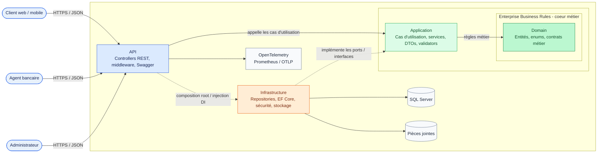
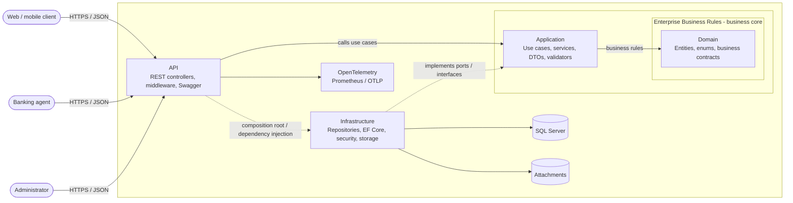

# Bank Complaint Management API

> API REST bancaire dédiée à la gestion du cycle de vie des réclamations clients, de leur création à leur résolution.

**Français** | [English](#english-version)


## À propos

Bank Complaint Management est un backend métier conçu pour digitaliser le traitement des réclamations bancaires. Il fournit une API sécurisée permettant aux clients de déposer et suivre leurs réclamations, et aux agents de les qualifier, affecter, traiter et clôturer dans le respect des priorités et des échéances SLA.

Le projet met en œuvre une Clean Architecture, des règles métier isolées, une authentification JWT, une persistance SQL Server et une couverture de tests unitaires et d'intégration. Il constitue une base réaliste pour une application bancaire moderne, maintenable et observable.

## Fonctionnalités principales

Le système couvre trois parcours principaux : celui du **client** qui dépose et suit une réclamation, celui de l'**agent** qui la traite, et celui de l'**administrateur** qui supervise les utilisateurs et l'activité globale.

### Parcours client

1. Le client crée son compte avec `POST /api/clients/register`.
2. Il se connecte avec `POST /api/auth/login` et reçoit un access token JWT ainsi qu'un refresh token.
3. Il consulte ou modifie son profil, change son mot de passe et consulte ses comptes bancaires et ses cartes.
4. Il dépose une réclamation avec sa catégorie, sa priorité, sa description et ses pièces jointes.
5. Il consulte uniquement ses réclamations, leurs détails et leur historique de messages.
6. Il reçoit des notifications et peut les marquer comme lues.

### Parcours agent

1. L'agent consulte uniquement les réclamations qui lui sont affectées.
2. Il recherche une réclamation par son identifiant ou sa référence métier.
3. Il peut la transférer vers un service, modifier sa priorité ou faire évoluer son statut.
4. Il peut rejeter une réclamation avec le motif correspondant.
5. Il échange avec le client via les messages liés à la réclamation.
6. Il suit les réclamations en retard, à haute priorité ou proches de leur échéance SLA.
7. Il consulte des statistiques et des compteurs pour piloter son activité.

### Parcours administrateur

1. L'administrateur est initialisé au démarrage de l'application à partir de `AdminSettings` si aucun compte administrateur n'existe.
2. Il consulte la liste des clients, leurs détails et leur statut.
3. Il active ou bloque les comptes clients.
4. Il crée et administre les agents, notamment leurs profils et leurs statuts.
5. Il consulte toutes les réclamations, y compris les réclamations non affectées.
6. Il peut les affecter, les transférer, modifier leur statut ou leur priorité, ou les rejeter.
7. Il consulte les réclamations en retard, à haute priorité et les indicateurs du dashboard.

### Capacités transverses

- **Authentification** : JWT Bearer, refresh token, déconnexion et hashage BCrypt des mots de passe.
- **Gestion des utilisateurs** : profils, statuts client/agent, création et administration des agents.
- **Administration** : supervision des clients, des agents et de l'ensemble du portefeuille de réclamations avec des droits réservés au rôle `Admin`.
- **Recherche et pilotage** : pagination, recherche par référence, filtres par statut/catégorie/priorité, tris par date/priorité/SLA et compteurs de dashboard.
- **Fichiers** : téléchargement des pièces jointes liées aux réclamations.
- **Qualité d'API** : validation FluentValidation, réponses JSON avec enums en texte et middleware centralisé de gestion des exceptions.
- **Exploitation** : migrations EF Core et seed de l'administrateur au démarrage, endpoint de santé, métriques Prometheus et traces OpenTelemetry.

## Architecture réelle du projet

Le projet utilise une **Clean Architecture** organisée en quatre projets. Chaque projet représente une responsabilité technique ou métier et les détails externes dépendent des composants internes :



**Lecture du diagramme :** le domaine métier est au centre et ne dépend d'aucun détail technique. L'application contient les cas d'utilisation. L'API et l'infrastructure sont des adaptateurs externes ; l'infrastructure implémente les interfaces attendues par l'application. Les flèches en pointillés représentent l'injection de dépendances et la composition de l'application au démarrage.

### Responsabilités des projets

| Projet | Responsabilité |
| --- | --- |
| `BankComplaintManagement.Domain` | Entités, enums et interfaces de repositories. Le projet ne référence aucun autre projet de la solution. |
| `BankComplaintManagement.Application` | Services de cas d'utilisation, DTOs, mappings, validators et interfaces de services. |
| `BankComplaintManagement.Infrastructure` | Implémentations EF Core/SQL Server, repositories, Unit of Work, JWT, BCrypt et stockage de fichiers. |
| `BankComplaintManagement.API` | Controllers REST, configuration HTTP, validation, middleware, Swagger et observabilité. |
| `BankComplaintManagement.Application.Tests` | Tests unitaires des services et validators |
| `BankComplaintManagement.IntegrationTests` | Tests d'intégration HTTP avec `WebApplicationFactory` et Testcontainers SQL Server |

## Stack technique

- **Plateforme** : .NET 9, ASP.NET Core Web API, C# avec nullable reference types.
- **Données** : Entity Framework Core 9, SQL Server, migrations et seed initial de l'administrateur.
- **Sécurité** : JWT Bearer, refresh tokens, BCrypt et contrôle d'accès basé sur les rôles.
- **Qualité** : xUnit, Moq, FluentValidation, tests unitaires et tests d'intégration.
- **API et documentation** : Swagger / OpenAPI, DTOs et AutoMapper.
- **Observabilité** : OpenTelemetry, métriques Prometheus et export OTLP.
- **Déploiement** : Docker multi-stage avec image runtime ASP.NET .NET 9 exécutée avec un utilisateur non privilégié.
- **CI/CD** : GitHub Actions pour la restauration, la compilation et les tests, puis la construction/publication de l'image Docker dans GHCR et la mise à jour du manifeste Kubernetes.

## API et cas d'utilisation

L'API est organisée par contrôleurs métier. Les routes protégées nécessitent un token JWT dans `Authorization: Bearer <token>`.

| Contrôleur | Ce qu'il permet de faire |
| --- | --- |
| `AuthController` - `/api/auth` | Se connecter, renouveler un token et se déconnecter. |
| `ClientController` - `/api/clients` | Créer un compte client, consulter/modifier le profil, changer le mot de passe, lister les clients et modifier leur statut. |
| `AgentController` - `/api/agent` | Lister et créer des agents, consulter les profils, modifier le mot de passe ou le statut et consulter les statistiques. Les opérations d'administration sont réservées à `Admin`. |
| `ComplaintController` - `/api/complaints` | Créer une réclamation, la consulter, la rechercher par référence, la filtrer, la trier, l'affecter, la transférer, modifier son statut/priorité ou la rejeter. |
| `MessageController` - `/api/messages` | Ajouter un message à une réclamation. |
| `NotificationController` - `/api/notifications` | Consulter les notifications et les marquer comme lues, individuellement ou toutes à la fois. |
| `AttachmentController` - `/api/attachments` | Télécharger une pièce jointe. |
| `BankAccountController` - `/api/bank-accounts` | Consulter les comptes bancaires du client authentifié. |
| `BankCardController` - `/api/bank-cards` | Consulter les cartes bancaires du client authentifié. |

Les rôles applicatifs sont `Client`, `Agent` et `Admin`. Le rôle `Admin` dispose des droits de supervision globale ; les routes sensibles utilisent l'autorisation JWT basée sur le rôle.

La liste exhaustive des paramètres et des schémas est disponible dans Swagger lorsque l'API est lancée : `/swagger`.

## Prérequis

- .NET SDK 9.0 ou supérieur
- SQL Server 2019 ou supérieur, ou Docker pour exécuter une instance locale
- Docker Desktop, uniquement pour le lancement conteneurisé ou les tests d'intégration

## Installation et configuration

1. Cloner le dépôt et se placer à sa racine.
2. Configurer les secrets hors du contrôle de version avec `dotnet user-secrets` ou des variables d'environnement.
3. Renseigner au minimum la chaîne `ConnectionStrings:DefaultConnection`, ainsi que `JwtSettings` et `AdminSettings`.

Exemple de configuration locale :

```bash
dotnet user-secrets init --project src/BankComplaintManagement.API
dotnet user-secrets set "ConnectionStrings:DefaultConnection" "Server=localhost;Database=BankComplaintManagement;Trusted_Connection=True;TrustServerCertificate=True" --project src/BankComplaintManagement.API
dotnet user-secrets set "JwtSettings:SecretKey" "change-this-development-secret-key" --project src/BankComplaintManagement.API
dotnet user-secrets set "JwtSettings:Issuer" "BankComplaintManagement" --project src/BankComplaintManagement.API
dotnet user-secrets set "JwtSettings:Audience" "BankComplaintManagement.Client" --project src/BankComplaintManagement.API
```

Les clés sensibles ne doivent pas être ajoutées dans `appsettings.json`. Au démarrage, l'application applique les migrations EF Core disponibles puis initialise le compte administrateur depuis `AdminSettings`.

## Lancer le projet

Depuis la racine de la solution :

```bash
dotnet restore BankComplaintManagement.sln
dotnet build BankComplaintManagement.sln --configuration Release
dotnet run --project src/BankComplaintManagement.API
```

Endpoints techniques utiles :

- `GET /health` : état de santé de l'API
- `GET /metrics` : métriques Prometheus
- `/swagger` : documentation interactive OpenAPI

## Tests

Les tests unitaires peuvent être exécutés sans infrastructure externe :

```bash
dotnet test tests/BankComplaintManagement.Application.Tests/BankComplaintManagement.Application.Tests.csproj
```

Les tests d'intégration utilisent `Microsoft.AspNetCore.Mvc.Testing` et Testcontainers pour lancer SQL Server :

```bash
dotnet test tests/BankComplaintManagement.IntegrationTests/BankComplaintManagement.IntegrationTests.csproj
```

Pour exécuter toute la suite :

```bash
dotnet test BankComplaintManagement.sln --configuration Release
```

## GitHub Actions et déploiement continu

Le workflow [`.github/workflows/backend-ci.yml`](.github/workflows/backend-ci.yml), nommé `Backend CI/CD`, est déclenché dans deux situations :

- à chaque `pull_request` vers `main` ;
- à chaque `push` vers `main`.

### Vérification sur les pull requests et les pushes

Le job `Build and Publish Backend` s'exécute sur `ubuntu-latest` avec .NET 9 et réalise les étapes suivantes :

1. récupération du code avec `actions/checkout` ;
2. installation du SDK .NET 9 avec `actions/setup-dotnet` ;
3. restauration des dépendances avec `dotnet restore` ;
4. compilation Release de `BankComplaintManagement.sln` ;
5. exécution des tests unitaires et d'intégration avec `dotnet test`.

Cette partie empêche une pull request de passer si la solution ne restaure pas, ne compile pas ou si les tests échouent.

### Publication sur un push vers `main`

Les étapes suivantes sont exécutées uniquement après un `push` vers `main` :

1. authentification auprès de GitHub Container Registry (`ghcr.io`) avec `GITHUB_TOKEN` ;
2. construction de l'image Docker du backend ;
3. publication de deux tags : le SHA exact du commit et `latest` ;
4. récupération du dépôt Kubernetes `fida-ghourabi/bank-complaint-management-infra` avec `INFRA_REPO_TOKEN` ;
5. remplacement de l'image du backend dans `k8s/api/deployment.yaml` par l'image taguée avec le SHA du commit ;
6. commit automatique de cette modification par `github-actions[bot]` et push vers le dépôt d'infrastructure.

Le flux est donc :

```text
Pull Request / Push main
	-> restore -> build -> tests
Push main uniquement
	-> build image Docker
	-> push image vers GHCR
	-> mise à jour du manifeste Kubernetes
	-> push du changement d'infrastructure
```

Le workflow utilise deux secrets GitHub : `GITHUB_TOKEN` pour publier l'image et `INFRA_REPO_TOKEN` pour modifier le dépôt d'infrastructure. Le déploiement Kubernetes est déclenché par la mise à jour du manifeste dans ce dépôt séparé.

## Lancer avec Docker

Construire l'image depuis la racine du dépôt :

```bash
docker build -t bank-complaint-management-api .
```

Puis lancer le conteneur en fournissant la configuration par variables d'environnement ou via un orchestrateur :

```bash
docker run --rm -p 8080:8080 \
	-e ConnectionStrings__DefaultConnection="Server=host.docker.internal;Database=BankComplaintManagement;User Id=sa;Password=YourStrongPassword;TrustServerCertificate=True" \
	bank-complaint-management-api
```

L'image expose le port `8080` et utilise une construction multi-stage afin de séparer la compilation de l'image d'exécution.

## Structure du dépôt

```text
src/
	BankComplaintManagement.API/             # Entrée HTTP et composition de l'application
	BankComplaintManagement.Application/     # Cas d'utilisation et validation
	BankComplaintManagement.Domain/           # Coeur métier
	BankComplaintManagement.Infrastructure/  # Persistance et services techniques
tests/
	BankComplaintManagement.Application.Tests/
	BankComplaintManagement.IntegrationTests/
```

## Points forts du projet

- Séparation nette des responsabilités et dépendances orientées vers le domaine.
- Workflow de réclamation explicite, adapté à un contexte bancaire et orienté suivi opérationnel.
- Sécurité intégrée dès la conception : authentification, rôles, hashage des mots de passe et secrets externalisés.
- Tests à deux niveaux : logique métier isolée et parcours HTTP avec une base SQL Server réelle en conteneur.
- Préparation à la production grâce aux migrations, au health check, aux métriques, aux traces et à une image Docker non root.

---

# English Version

> Banking REST API dedicated to the complete lifecycle of customer complaints, from submission to resolution.

## About

Bank Complaint Management is a business backend designed to digitalize the handling of banking complaints. It provides a secure API that enables customers to submit and track complaints, while agents can qualify, assign, process and close them according to priorities and SLA deadlines.

The project follows Clean Architecture principles, isolates business rules, uses JWT authentication, persists data in SQL Server and includes unit and integration tests. It provides a realistic foundation for a maintainable and observable banking application.

## Main Features

The system supports three user journeys: the **customer**, who submits and tracks complaints; the **agent**, who processes assigned complaints; and the **administrator**, who supervises users and global activity.

### Customer journey

1. The customer registers with `POST /api/clients/register`.
2. The customer signs in with `POST /api/auth/login` and receives an access JWT and a refresh token.
3. The customer manages the profile and password and views bank accounts and cards.
4. The customer submits a complaint with its category, priority, description and attachments.
5. The customer views only their own complaints, details and message history.
6. The customer receives notifications and can mark them as read.

### Agent journey

1. The agent views only complaints assigned to that agent.
2. The agent searches for a complaint by identifier or business reference.
3. The agent can transfer it, change its priority or update its status.
4. The agent can reject a complaint with a reason.
5. The agent communicates with the customer through complaint messages.
6. The agent monitors overdue, high-priority and SLA-sensitive complaints.
7. The agent views statistics and counters to track assigned work.

### Administrator journey

1. The administrator is initialized at startup from `AdminSettings` when no administrator exists.
2. The administrator views customers, their details and statuses.
3. The administrator activates or blocks customer accounts.
4. The administrator creates and manages agents.
5. The administrator views all complaints, including unassigned complaints.
6. The administrator can assign, transfer, update or reject complaints.
7. The administrator monitors overdue and high-priority complaints and global dashboard indicators.

### Cross-cutting capabilities

- **Authentication**: JWT Bearer, refresh tokens, logout and BCrypt password hashing.
- **User management**: customer and agent profiles, statuses and agent administration.
- **Administration**: global supervision through the `Admin` role.
- **Search and monitoring**: pagination, reference lookup, filters, sorting and dashboard counters.
- **Files**: download of complaint attachments.
- **API quality**: FluentValidation, text-based JSON enums and centralized exception handling.
- **Operations**: EF Core migrations, administrator seeding, health checks, Prometheus metrics and OpenTelemetry traces.

## Project Architecture

The project follows **Clean Architecture** and is organized into four projects. Business rules remain inside the application core while external details are implemented by adapters:



**How to read the diagram:** the business domain is at the center and does not depend on technical details. The application contains the use cases. The API and infrastructure are external adapters; infrastructure implements the interfaces expected by the application. Dashed arrows represent dependency injection and application composition at startup.

### Project responsibilities

| Project | Responsibility |
| --- | --- |
| `BankComplaintManagement.Domain` | Entities, enums and repository interfaces. It references no other project. |
| `BankComplaintManagement.Application` | Use-case services, DTOs, mappings, validators and service interfaces. |
| `BankComplaintManagement.Infrastructure` | EF Core/SQL Server implementations, repositories, Unit of Work, JWT, BCrypt and file storage. |
| `BankComplaintManagement.API` | REST controllers, HTTP configuration, validation, middleware, Swagger and observability. |
| `BankComplaintManagement.Application.Tests` | Unit tests for services and validators. |
| `BankComplaintManagement.IntegrationTests` | HTTP integration tests with `WebApplicationFactory` and Testcontainers SQL Server. |

## Technology Stack

- **Platform**: .NET 9, ASP.NET Core Web API and nullable reference types.
- **Data**: Entity Framework Core 9, SQL Server, migrations and administrator seeding.
- **Security**: JWT Bearer, refresh tokens, BCrypt and role-based authorization.
- **Quality**: xUnit, Moq, FluentValidation, unit tests and integration tests.
- **API and documentation**: Swagger / OpenAPI, DTOs and AutoMapper.
- **Observability**: OpenTelemetry, Prometheus metrics and OTLP export.
- **Deployment**: multi-stage Docker image with the .NET 9 ASP.NET runtime and a non-root user.
- **CI/CD**: GitHub Actions for restore, build and tests, Docker image publication to GHCR and Kubernetes manifest update.

## API and Use Cases

Protected routes require a JWT in `Authorization: Bearer <token>`.

| Controller | Responsibilities |
| --- | --- |
| `AuthController` - `/api/auth` | Sign in, refresh a token and sign out. |
| `ClientController` - `/api/clients` | Register customers, manage profiles and update customer statuses. |
| `AgentController` - `/api/agent` | Manage agents, profiles, statuses and statistics. Administrative operations are reserved for `Admin`. |
| `ComplaintController` - `/api/complaints` | Create, view, search, filter, sort, assign, transfer, update and reject complaints. |
| `MessageController` - `/api/messages` | Add a message to a complaint. |
| `NotificationController` - `/api/notifications` | View notifications and mark them as read. |
| `AttachmentController` - `/api/attachments` | Download an attachment. |
| `BankAccountController` - `/api/bank-accounts` | View accounts belonging to the authenticated customer. |
| `BankCardController` - `/api/bank-cards` | View cards belonging to the authenticated customer. |

The application roles are `Client`, `Agent` and `Admin`. The complete list of parameters and schemas is available in Swagger at `/swagger`.

## Prerequisites

- .NET SDK 9.0 or later.
- SQL Server 2019 or later, or Docker for a local instance.
- Docker Desktop for containerized execution or integration tests.

## Installation and Configuration

1. Clone the repository and move to its root directory.
2. Store secrets outside source control using `dotnet user-secrets` or environment variables.
3. Configure `ConnectionStrings:DefaultConnection`, `JwtSettings` and `AdminSettings`.

Do not add sensitive values to `appsettings.json`. At startup, the application applies EF Core migrations and initializes the administrator account from `AdminSettings`.

## Run the Project

```bash
dotnet restore BankComplaintManagement.sln
dotnet build BankComplaintManagement.sln --configuration Release
dotnet run --project src/BankComplaintManagement.API
```

Useful endpoints: `GET /health`, `GET /metrics` and `/swagger`.

## Tests

```bash
dotnet test tests/BankComplaintManagement.Application.Tests/BankComplaintManagement.Application.Tests.csproj
dotnet test tests/BankComplaintManagement.IntegrationTests/BankComplaintManagement.IntegrationTests.csproj
dotnet test BankComplaintManagement.sln --configuration Release
```

Integration tests use `WebApplicationFactory` and Testcontainers to start SQL Server, so Docker Desktop must be running.

## GitHub Actions and Continuous Delivery

The [`.github/workflows/backend-ci.yml`](.github/workflows/backend-ci.yml) workflow, named `Backend CI/CD`, runs on every `pull_request` targeting `main` and every `push` to `main`.

On pull requests and pushes, it checks out the code, installs .NET 9, restores dependencies, builds the solution in Release mode and runs all tests.

On a push to `main`, it additionally logs in to GHCR, builds and publishes Docker images tagged with the commit SHA and `latest`, updates `k8s/api/deployment.yaml` in the infrastructure repository, then commits and pushes that change.

```text
Pull Request / Push main
	-> restore -> build -> tests
Push main only
	-> build Docker image
	-> push image to GHCR
	-> update Kubernetes manifest
	-> push infrastructure change
```

The workflow uses `GITHUB_TOKEN` to publish the image and `INFRA_REPO_TOKEN` to modify the infrastructure repository.

## Run with Docker

```bash
docker build -t bank-complaint-management-api .
docker run --rm -p 8080:8080 bank-complaint-management-api
```

The image exposes port `8080` and uses a multi-stage build to separate compilation from runtime.

## Repository Structure

```text
src/
	BankComplaintManagement.API/             # HTTP entry point and application composition
	BankComplaintManagement.Application/     # Use cases and validation
	BankComplaintManagement.Domain/           # Business core
	BankComplaintManagement.Infrastructure/  # Persistence and technical services
tests/
	BankComplaintManagement.Application.Tests/
	BankComplaintManagement.IntegrationTests/
```

## Project Strengths

- Clear separation of responsibilities with dependencies directed toward the business core.
- An explicit complaint workflow designed for banking operations and SLA tracking.
- Security built in from the start: authentication, roles, password hashing and externalized secrets.
- Two testing levels: isolated business logic and HTTP flows backed by a real SQL Server container.
- Production-oriented foundations through migrations, health checks, metrics, traces and a non-root Docker image.
